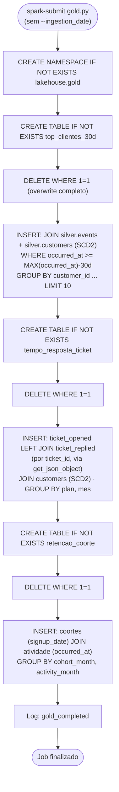
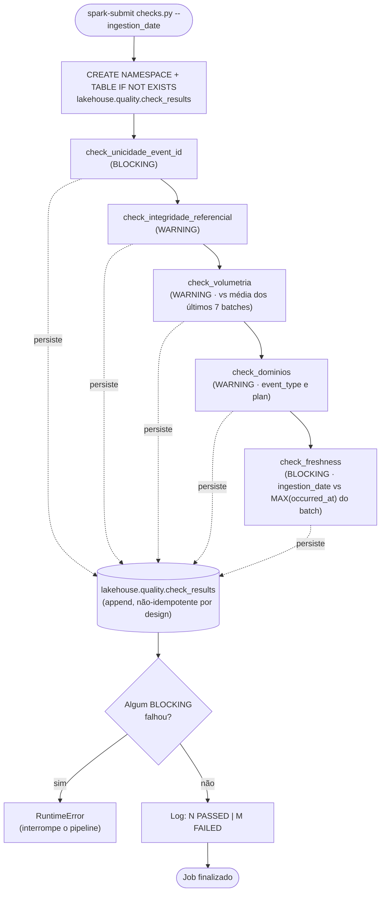
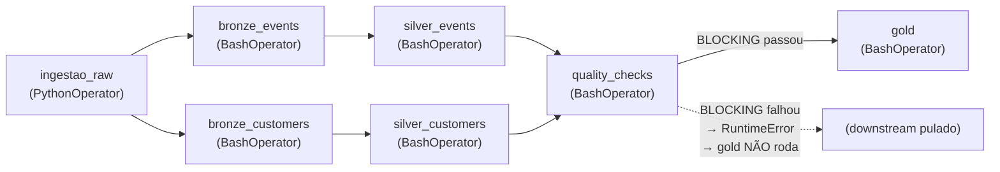

# Lakehouse Desafio — Ingestão, Bronze, Silver, Gold e Qualidade

Pipeline de dados em camadas para o desafio técnico de lakehouse
on-premises (MinIO · Iceberg · Spark · Trino):

1. **Ingestão** (`ingestion/`): extrai dados de duas fontes (uma API REST e
   um banco PostgreSQL), persiste os registros brutos em formato NDJSON
   comprimido (`.json.gz`) no MinIO/S3 seguindo particionamento Hive por
   `ingestion_date`, e controla incrementalidade via watermarks.
2. **Transformação** (`transform/`): jobs PySpark que leem a raw zone e
   materializam tabelas Iceberg em três camadas — **Bronze** (fiel à raw,
   só tipagem básica), **Silver** (deduplicada, tipada e com SCD Tipo 2
   para o histórico de clientes) e **Gold** (tabelas analíticas
   pré-calculadas para as 3 queries de negócio).
3. **Qualidade** (`quality/`): checks de qualidade sobre a Silver, com
   resultados persistidos em `lakehouse.quality.check_results` e dois
   níveis de severidade (`BLOCKING` interrompe o pipeline, `WARNING` só
   registra).

Ver também [`RODAR_PIPELINE.md`](RODAR_PIPELINE.md) para todos os comandos
de execução e validação, camada por camada ou na sequência completa.

## Rodar tudo em 3 comandos

O enunciado pede que seja possível validar a entrega com no máximo 3
comandos. Do zero (ambiente ainda não existe ou está sujo de testes
anteriores):

```bash
# 1. Sobe o ambiente do zero (containers do MinIO, Postgres, mock API,
#    Iceberg REST, Spark e Trino) e valida (12/12 checks)
cd /caminho/para/o/repo-de-infra && make restart

# 2. Instala as dependências Python da ingestão (uma vez só)
cd /caminho/para/este/repo && pipenv install

# 3. Roda a sequência de teste completa exigida pelo desafio —
#    pipeline(batch1) -> pipeline(batch1 de novo) -> batch2 -> pipeline -> pipeline de novo —
#    em todas as camadas (ingestão, bronze, silver, qualidade, gold),
#    mostrando o resultado de cada etapa
INFRA_DIR=/caminho/para/o/repo-de-infra ./run_full_pipeline_test.sh
```

`INFRA_DIR` é obrigatória (o script não assume nenhum caminho padrão) —
aponte para o repositório de infraestrutura (docker-compose com MinIO,
Postgres, mock API, Spark e Trino).

O script (`run_full_pipeline_test.sh`) faz o `docker cp` de `transform/` e
`quality/` para o container Spark, roda cada etapa, mostra as contagens do
Trino após cada batch e termina com um resumo (`Etapas OK` / `Etapas
FALHOU`, exit code não-zero se algo falhar). Ele mesmo dispara o
`make batch2` no meio da sequência — não precisa rodar isso à parte.

Se o ambiente já estiver de pé e limpo (por exemplo, logo após um
`make up`), o comando 1 pode ser pulado — bastam os comandos 2 e 3.

## Estrutura do repositório

```
ingestion/
├── config.py            # Carrega variáveis de ambiente (.env) e constantes do pipeline
├── api_client.py         # Extração da fonte "events" via API REST (paginação + retry)
├── postgres_client.py     # Extração da fonte "customers" via PostgreSQL
├── watermark.py          # Leitura/escrita do estado incremental (watermark) no MinIO
├── storage.py            # Serialização NDJSON + gravação comprimida (gzip) no MinIO
└── ingest.py             # Orquestrador: liga todos os módulos acima

transform/
├── config.py             # Constantes de negócio (catálogo, namespaces, prefixos raw)
├── bronze_events.py      # Job PySpark: raw/events → lakehouse.bronze.events
├── bronze_customers.py   # Job PySpark: raw/customers → lakehouse.bronze.customers
├── silver_events.py      # Job PySpark: bronze.events → lakehouse.silver.events (dedup)
├── silver_customers.py   # Job PySpark: bronze.customers → lakehouse.silver.customers (SCD2)
└── gold.py               # Job PySpark: silver → lakehouse.gold.* (3 tabelas analíticas)

quality/
└── checks.py             # 5 checks de qualidade sobre a Silver → lakehouse.quality.check_results

sql/
├── query1_top10_clientes.sql          # Top 10 clientes por volume de eventos (30d)
├── query2_tempo_resposta_ticket.sql   # Tempo médio de resposta por plano/mês
├── query3_retencao_coorte.sql         # Retenção por coorte de aquisição
└── resultados/                        # CSVs de entrega gerados via Trino

dags/
└── dag_pipeline.py        # DAG do Airflow: orquestra ingestão → bronze → silver → quality → gold

tests/                     # Scripts de teste manual (ingestão + conexão Spark/Iceberg)

run_full_pipeline_test.sh  # Roda a sequência de teste completa do desafio (ver "Rodar tudo em 3 comandos")
```

## Camada de Ingestão (raw zone)

### `config.py`
Carrega variáveis de ambiente com `python-dotenv` e expõe constantes usadas por
todos os outros módulos (endpoint/credenciais do MinIO, URL/chave da API,
credenciais do Postgres, e os caminhos fixos usados no lakehouse:
`WATERMARK_KEY`, `RAW_EVENTS_PREFIX`, `RAW_CUSTOMERS_PREFIX`).

### `api_client.py`
Responsável por extrair a fonte **events** de uma API REST paginada.

- `fetch_all_events(since)`: percorre todas as páginas retornadas pela API
  (usando `since`, ou `1970-01-01T00:00:00Z` na primeira execução), aplica um
  throttle de 0.1s entre requisições e retorna `(records, metrics)`.
- `_fetch_page_with_retry(...)`: busca uma única página tratando:
  - **HTTP 429** → aguarda o tempo do header `Retry-After` (fallback 60s);
  - **HTTP 5xx / erro de conexão** → backoff exponencial (1s, 2s, 4s, 8s, 16s)
    até 5 tentativas;
  - **HTTP 4xx** → interrompe imediatamente (erro de cliente, não é retryable).
- **Filtro de fronteira client-side**: a API trata `since` como **inclusivo**
  (`>=`), então o registro com `updated_at` igual ao watermark volta a cada
  execução. Depois de paginar tudo, `fetch_all_events` filtra
  `updated_at > since_param` antes de retornar — sem isso, rodar a ingestão
  duas vezes no mesmo dia reprocessaria (e, pior, sobrescreveria o arquivo
  raw do dia com) esse registro de fronteira. Detalhes da investigação em
  [`AJUSTES_PARTE2_TRANSFORM.md`](AJUSTES_PARTE2_TRANSFORM.md).

### `postgres_client.py`
Responsável por extrair a fonte **customers** do PostgreSQL.

- `fetch_customers(since)`: consulta `crm.customers` filtrando
  `updated_at > since`, ordenado por `updated_at ASC`, converte os campos de
  data para string serializável em JSON e devolve a lista de registros.

### `watermark.py`
Controla o estado incremental do pipeline, guardado em um único arquivo JSON
no MinIO (`raw/control/watermarks.json`), com uma chave por fonte.

- `read_watermark(s3_client, source)`: lê o `last_updated_at` salvo para a
  fonte. Se o arquivo não existir (`NoSuchKey`) ou estiver corrompido, trata
  como primeira execução e retorna `None`.
- `write_watermark(s3_client, source, last_updated_at)`: atualiza apenas a
  chave da fonte informada, preservando o estado das demais fontes.

### `storage.py`
Persiste os registros extraídos na **raw zone** do lakehouse.

- `_to_ndjson(records)`: serializa a lista de dicionários em NDJSON (um JSON
  por linha).
- `save_raw_batch(s3_client, records, source, ingestion_date)`: gera o NDJSON,
  comprime com `gzip` e grava no MinIO seguindo particionamento Hive:

  ```
  raw/<source>/ingestion_date=<YYYY-MM-DD>/part-000.json.gz
  ```

  Content-Type gravado como `application/gzip`. Se não houver registros,
  nenhum objeto é criado.

### `ingest.py`
Orquestrador do pipeline (`run_pipeline(ingestion_date)`), executado via
`python -m ingestion.ingest [YYYY-MM-DD]` (usa a data de hoje se omitida).
Para cada fonte (`events`, `customers`):

1. lê o watermark atual;
2. extrai os dados novos desde o watermark;
3. se houver registros, grava o lote comprimido no MinIO e atualiza o
   watermark com o maior `updated_at` do lote;
4. se não houver registros, apenas loga e segue para a próxima fonte.

Ao final, loga um evento estruturado `ingestion_completed` com a contagem de
registros processados por fonte.

## Camada de Transformação (Bronze + Silver)

Jobs PySpark que rodam **dentro do container Spark** (`dl-spark`), lendo a
raw zone e materializando tabelas Iceberg. Cada job é independente e
idempotente — pode ser executado quantas vezes forem necessárias para o
mesmo `ingestion_date` sem duplicar dado.

### `transform/config.py`
Constantes de negócio compartilhadas pelos jobs (catálogo Iceberg, namespaces
`bronze`/`silver`, prefixos da raw zone). Usa só `os.getenv(..., default)`
— sem `python-dotenv`, porque dentro do container não existe `.env` para
carregar (os defaults já cobrem a rede interna dos containers, ex.
`http://minio:9000`).

### `transform/bronze_events.py`
Lê `raw/events/ingestion_date=<data>/*.json.gz`, converte `properties` (JSON
aninhado) para string JSON, adiciona colunas de controle
(`_ingested_at`, `_source_file`, `_batch_id`) e grava em
`lakehouse.bronze.events` **sem** deduplicar ou tipar (Bronze é fiel à raw —
isso fica para a Silver). Sem particionamento (volume por batch é pequeno;
particionamento é decisão da Silver).

- **Idempotência**: `DELETE WHERE _batch_id = <ingestion_date>` antes do
  `append` — rodar duas vezes para o mesmo dia produz o mesmo resultado.
- **Schema drift**: a tabela tem `write.spark.accept-any-schema=true` e o
  write usa `mergeSchema=true`, então um campo novo no payload da API (ex.
  `source_app`, introduzido no batch 2) vira uma coluna nova automaticamente,
  nula nos registros antigos. As colunas do DataFrame são reordenadas
  explicitamente antes do write, porque o Iceberg exige que a ordem física
  bata com a da tabela. Detalhes em
  [`AJUSTES_PARTE2_TRANSFORM.md`](AJUSTES_PARTE2_TRANSFORM.md).

### `transform/bronze_customers.py`
Mesma lógica do `bronze_events.py`, para `raw/customers/`. Sem conversão de
`properties` (não existe nessa fonte). `is_active` chega como booleano nativo
do Postgres e é convertido explicitamente para `STRING` antes do write — a
Bronze declara esse campo como `STRING` de propósito (a conversão para
`BOOLEAN` é trabalho da Silver).

### `transform/silver_events.py`
Lê `lakehouse.bronze.events` do batch atual, deduplica por `event_id`
mantendo o registro com maior `updated_at` (a API pode retornar duplicatas
entre páginas), tipa `occurred_at`/`updated_at` como `TIMESTAMP`, marca
eventos com `customer_id` nulo via `_customer_exists` (nunca descarta dado
silenciosamente) e faz upsert em `lakehouse.silver.events` via `MERGE INTO`.

- Tabela particionada por `days(occurred_at)` — as queries analíticas da
  Gold filtram por janela temporal, então o partition pruning importa aqui.
- `write.merge.mode = merge-on-read` — otimiza o `MERGE INTO` para não
  reescrever partições inteiras a cada execução.
- **Idempotência**: `WHEN MATCHED AND source.updated_at > target.updated_at
  THEN UPDATE` + `WHEN NOT MATCHED THEN INSERT` — registros já processados
  com o mesmo ou menor `updated_at` são ignorados.

### `transform/silver_customers.py`
Lê `lakehouse.bronze.customers` do batch atual e aplica **SCD Tipo 2** em
`lakehouse.silver.customers`, para responder "qual era o plano do cliente na
data de um evento":

- `valid_from`/`valid_to` delimitam a validade de cada versão do registro;
  `is_current` marca a versão vigente; `valid_to = 9999-12-31` é o sentinela
  para "ainda vigente".
- Dois `MERGE INTO` separados: um fecha as versões antigas que mudaram
  (`valid_to`/`is_current`), outro insere as versões novas. São separados
  porque o Iceberg não suporta lógicas de matching diferentes num único
  `MERGE INTO`.
- **Idempotência**: reexecutar para o mesmo batch não fecha nem duplica
  versões, porque a condição de fechamento exige `updated_at` estritamente
  maior que o já registrado.

## Camada Gold (`transform/gold.py`)

Job único que recalcula, do zero, as 3 tabelas analíticas em
`lakehouse.gold` a partir da Silver — **não** recebe `--ingestion_date`,
sempre considera o estado completo. `DELETE ... WHERE 1=1` + `INSERT`
(overwrite completo) a cada execução, então é idempotente por construção.

- **`top_clientes_30d`**: top 10 clientes por volume de eventos, na janela
  de 30 dias relativa a `MAX(occurred_at)` da Silver — não `CURRENT_DATE`,
  já que o dataset é sintético e fixo no tempo. Enriquece com
  `company_name`/`plan`/`segment` **na data do evento** via o SCD2 da
  Silver (`occurred_at BETWEEN valid_from AND valid_to`). Exclui eventos
  órfãos (`_customer_exists = false`).
- **`tempo_resposta_ticket`**: tempo médio (minutos) entre `ticket_opened`
  e o primeiro `ticket_replied` do mesmo `ticket_id`, por plano e mês.
  `LEFT JOIN` garante que tickets sem resposta aparecem no resultado com
  `tickets_sem_resposta` explícito, em vez de serem descartados.
- **`retencao_coorte`**: percentual de clientes com pelo menos 1 evento por
  mês, agrupados pelo mês de `signup_date` (coorte de aquisição). Usa só
  `is_current = true` para não duplicar clientes com histórico SCD2.

As 3 queries de entrega (`sql/query{1,2,3}_*.sql`) só leem essas tabelas já
materializadas — a lógica pesada (joins com SCD2, agregações) fica no job,
não na query de consulta. Resultados e interpretações em
`sql/resultados/*.csv` e nos comentários finais de cada `.sql`.

## Camada de Qualidade (`quality/checks.py`)

Roda sobre a Silver, persiste cada resultado em
`lakehouse.quality.check_results` (**não** é idempotente por design — o
histórico de execuções é o que importa para auditoria) e levanta
`RuntimeError` se algum check `BLOCKING` falhar.

| Check | Severidade | O que valida |
|---|---|---|
| `unicidade_event_id` | BLOCKING | Duplicatas de `event_id` na Silver (indicaria falha no `MERGE INTO`) |
| `integridade_referencial_customer_id` | WARNING | Eventos com `customer_id` sem correspondência em `silver.customers` — comportamento documentado da fonte, não é falha |
| `volumetria_events` | WARNING | Variação do volume do batch atual vs. média dos últimos 7 batches (limite: 50%) |
| `dominios_invalidos` | WARNING | Valores fora do domínio esperado em `event_type` e `plan` |
| `freshness_events` | BLOCKING | Defasagem entre o `ingestion_date` do batch e o `MAX(occurred_at)` daquele batch (limite: 2 dias) |

Dois ajustes em relação à especificação original, documentados em
[`AJUSTES_PARTE4_QUALITY.md`](AJUSTES_PARTE4_QUALITY.md): a lista de
`event_type` válidos inclui `feature_used` (ausente na spec original), e o
`freshness_events` compara contra o `ingestion_date` do próprio batch, não
contra o relógio real da máquina — um dataset sintético e fixo no tempo
faria esse check `BLOCKING` falhar permanentemente conforme os dias reais
passam, mesmo com o pipeline saudável.

## Orquestração (`dags/dag_pipeline.py`)

DAG do Airflow que encadeia todas as camadas acima. **Não precisa rodar no
ambiente para valer pontuação** — o enunciado aceita código bem estruturado
+ explicação. Ainda assim, o código foi escrito para ser executável de
verdade: se o Airflow for subido (`make airflow`, perfil opcional do
`docker-compose` do ambiente) com este arquivo copiado para a pasta `dags/`
montada em `/opt/airflow/dags`, ele funciona sem modificação, desde que os
scripts já estejam copiados para `/tmp/transform` e `/tmp/quality` dentro
do `dl-spark` (mesmo passo manual que já fazemos hoje via `docker cp`).

**Grafo de dependências**:
```
ingestao_raw
    ├── bronze_events ──────── silver_events ────┐
    └── bronze_customers ───── silver_customers ─┴── quality_checks ── gold
```

- **Ingestão** (`PythonOperator`): chama `run_pipeline` diretamente, sem
  `subprocess` — mais robusto que depender do `pipenv` estar no PATH do
  worker do Airflow. Roda no host, não no container Spark.
- **Bronze e Silver em paralelo** (`BashOperator` + `docker exec`): não há
  cluster Spark com master/worker para o `SparkSubmitOperator` se conectar
  — os jobs rodam via `docker exec` no container `dl-spark`, então
  `BashOperator` é a forma real de submetê-los. `bronze_events` e
  `bronze_customers` não dependem uma da outra (fontes independentes); o
  mesmo vale para as duas Silvers.
- **Qualidade bloqueia a Gold sem lógica extra**: se um check `BLOCKING`
  falhar, `quality/checks.py` levanta `RuntimeError` → `spark-submit`
  termina com exit code não-zero → a task falha → o Airflow não executa a
  task `gold` downstream. Comportamento correto de "não calcular a Gold
  sobre dado corrompido" sem nenhum código adicional na DAG.
- **`{{ ds }}` em vez de `datetime.now()`**: `ds` é a data lógica da
  execução (formato `YYYY-MM-DD`). Usar o relógio real quebraria o
  backfill — todas as execuções acabariam processando a data de hoje em
  vez da data que lhes cabe.
- **`catchup=True` + `max_active_runs=1`**: `catchup` permite backfill
  seguro porque cada etapa é idempotente (raw sobrescreve por partição,
  Bronze faz delete+append por `_batch_id`, Silver faz `MERGE INTO`, Gold
  faz overwrite completo). `max_active_runs=1` evita que dois backfills
  concorrentes escrevam nas mesmas tabelas Iceberg ao mesmo tempo — o
  `MERGE INTO` não é seguro para escrita concorrente sem controle de
  transação distribuída.
- **`start_date` fixo (`2026-03-11`, data do primeiro batch real)**: nunca
  `days_ago(1)` nem `datetime.now()` — o `start_date` precisa ser
  determinístico para o backfill fazer sentido.
- **`depends_on_past=False`**: cada execução é independente graças ao
  watermark — a ingestão sempre sabe de onde continuar, mesmo que o dia
  anterior tenha falhado.
- **Gold sem `--ingestion_date`**: sempre recalcula do estado completo da
  Silver, independente de qual batch disparou a execução.

Backfill manual, se necessário:
```bash
airflow dags backfill lakehouse_pipeline \
    --start-date 2026-03-11 \
    --end-date 2026-03-15
```

## Como executar

Ingestão (raw zone), rodando no host:

```bash
python -m ingestion.ingest [YYYY-MM-DD]   # usa a data de hoje se omitida
```

Jobs de transformação, rodando dentro do container Spark — copie a pasta
`transform/` para o container e submeta com `PYTHONPATH=/tmp` (para o import
`from transform import config` resolver):

```bash
docker cp transform dl-spark:/tmp/transform

docker exec -e PYTHONPATH=/tmp dl-spark spark-submit \
    /tmp/transform/bronze_events.py --ingestion_date 2026-03-11
docker exec -e PYTHONPATH=/tmp dl-spark spark-submit \
    /tmp/transform/bronze_customers.py --ingestion_date 2026-03-11
docker exec -e PYTHONPATH=/tmp dl-spark spark-submit \
    /tmp/transform/silver_events.py --ingestion_date 2026-03-11
docker exec -e PYTHONPATH=/tmp dl-spark spark-submit \
    /tmp/transform/silver_customers.py --ingestion_date 2026-03-11
```

Gold — não recebe `--ingestion_date`:

```bash
docker exec -e PYTHONPATH=/tmp dl-spark spark-submit /tmp/transform/gold.py
```

Qualidade — mesmo padrão de deploy, mas copiando `quality/`:

```bash
docker cp quality dl-spark:/tmp/quality

docker exec -e PYTHONPATH=/tmp dl-spark spark-submit \
    /tmp/quality/checks.py --ingestion_date 2026-03-11
```

Ver [`RODAR_PIPELINE.md`](RODAR_PIPELINE.md) para a lista completa de
comandos (ambiente, cada etapa isolada, e a sequência de aceite do desafio).

## Diagrama de execução — Ingestão (raw)


## Diagrama de execução — Bronze


## Diagrama de execução — Silver


## Diagrama de execução — Gold



## Diagrama de execução — Qualidade



## Diagrama da DAG (Airflow)



## Camadas externas (arquitetura completa)

```mermaid
flowchart LR
    API[("API REST\n(events)")] --> api_client.py
    PG[("PostgreSQL\n(crm.customers)")] --> postgres_client.py
    api_client.py --> ingest.py
    postgres_client.py --> ingest.py
    ingest.py <--> watermark.py
    ingest.py --> storage.py
    watermark.py <--> MinIO[("MinIO / S3\nraw/control/watermarks.json")]
    storage.py --> RawZone[("MinIO / S3 — raw zone\nraw/&lt;source&gt;/ingestion_date=.../part-000.json.gz")]

    RawZone --> BronzeEvents["bronze_events.py"]
    RawZone --> BronzeCustomers["bronze_customers.py"]
    BronzeEvents --> IcebergBronze[("Iceberg REST Catalog\nlakehouse.bronze.events / .customers")]
    BronzeCustomers --> IcebergBronze

    IcebergBronze --> SilverEvents["silver_events.py\n(dedup + tipagem)"]
    IcebergBronze --> SilverCustomers["silver_customers.py\n(SCD Tipo 2)"]
    SilverEvents --> IcebergSilver[("Iceberg REST Catalog\nlakehouse.silver.events / .customers")]
    SilverCustomers --> IcebergSilver

    IcebergSilver --> Quality["quality/checks.py\n(5 checks, BLOCKING/WARNING)"]
    Quality --> IcebergQuality[("lakehouse.quality.check_results")]

    IcebergSilver --> Gold["transform/gold.py\n(3 tabelas analíticas)"]
    Gold --> IcebergGold[("Iceberg REST Catalog\nlakehouse.gold.*")]

    IcebergBronze -.consulta.-> Trino[("Trino")]
    IcebergSilver -.consulta.-> Trino
    IcebergGold -.consulta.-> Trino
    IcebergQuality -.consulta.-> Trino
    Trino --> SQL["sql/query{1,2,3}_*.sql\n→ sql/resultados/*.csv"]
```


