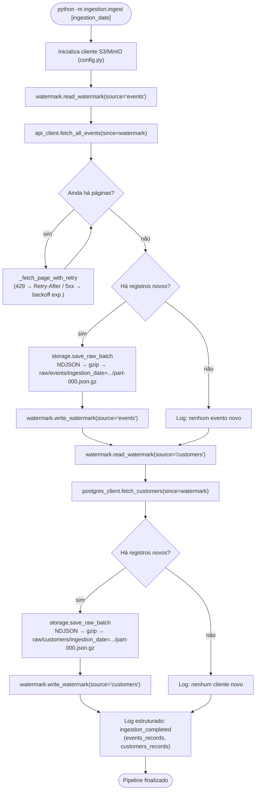
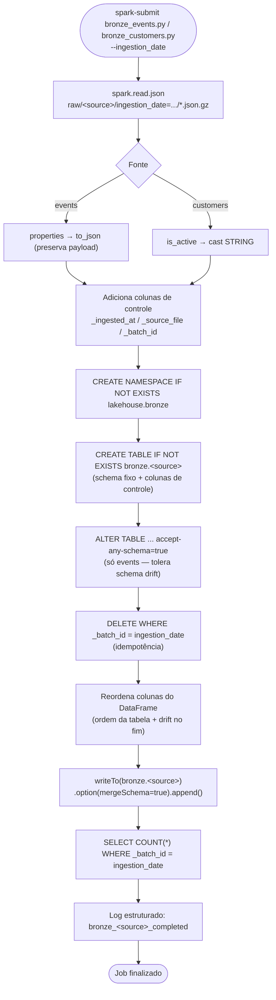
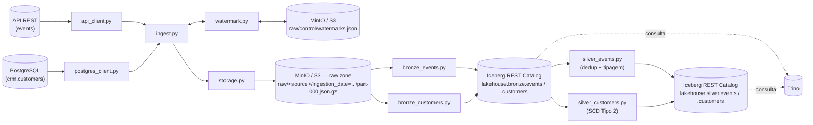

# Lakehouse Desafio — Ingestão (Raw), Bronze e Silver

Pipeline de dados em camadas para o desafio técnico de lakehouse
on-premises (MinIO · Iceberg · Spark · Trino):

1. **Ingestão** (`ingestion/`): extrai dados de duas fontes (uma API REST e
   um banco PostgreSQL), persiste os registros brutos em formato NDJSON
   comprimido (`.json.gz`) no MinIO/S3 seguindo particionamento Hive por
   `ingestion_date`, e controla incrementalidade via watermarks.
2. **Transformação** (`transform/`): jobs PySpark que leem a raw zone e
   materializam tabelas Iceberg em duas camadas — **Bronze** (fiel à raw,
   só tipagem básica) e **Silver** (deduplicada, tipada e com SCD Tipo 2
   para o histórico de clientes).

## Estrutura do repositório

```
ingestion/
├── config.py            # Carrega variáveis de ambiente (.env) e constantes do pipeline
├── api_client.py         # Extração da fonte "events" via API REST (paginação + retry)
├── postgres_client.py     # Extração da fonte "customers" via PostgreSQL
├── watermark.py          # Leitura/escrita do estado incremental (watermark) no MinIO
├── storage.py            # Serialização NDJSON + gravação comprimida (gzip) no MinIO
└── ingest.py             # Orquestrador: liga todos os módulos acima

transform/
├── config.py             # Constantes de negócio (catálogo, namespaces, prefixos raw)
├── bronze_events.py      # Job PySpark: raw/events → lakehouse.bronze.events
├── bronze_customers.py   # Job PySpark: raw/customers → lakehouse.bronze.customers
├── silver_events.py      # Job PySpark: bronze.events → lakehouse.silver.events (dedup)
└── silver_customers.py   # Job PySpark: bronze.customers → lakehouse.silver.customers (SCD2)
```

## Camada de Ingestão (raw zone)

### `config.py`
Carrega variáveis de ambiente com `python-dotenv` e expõe constantes usadas por
todos os outros módulos (endpoint/credenciais do MinIO, URL/chave da API,
credenciais do Postgres, e os caminhos fixos usados no lakehouse:
`WATERMARK_KEY`, `RAW_EVENTS_PREFIX`, `RAW_CUSTOMERS_PREFIX`).

### `api_client.py`
Responsável por extrair a fonte **events** de uma API REST paginada.

- `fetch_all_events(since)`: percorre todas as páginas retornadas pela API
  (usando `since`, ou `1970-01-01T00:00:00Z` na primeira execução), aplica um
  throttle de 0.1s entre requisições e retorna `(records, metrics)`.
- `_fetch_page_with_retry(...)`: busca uma única página tratando:
  - **HTTP 429** → aguarda o tempo do header `Retry-After` (fallback 60s);
  - **HTTP 5xx / erro de conexão** → backoff exponencial (1s, 2s, 4s, 8s, 16s)
    até 5 tentativas;
  - **HTTP 4xx** → interrompe imediatamente (erro de cliente, não é retryable).
- **Filtro de fronteira client-side**: a API trata `since` como **inclusivo**
  (`>=`), então o registro com `updated_at` igual ao watermark volta a cada
  execução. Depois de paginar tudo, `fetch_all_events` filtra
  `updated_at > since_param` antes de retornar — sem isso, rodar a ingestão
  duas vezes no mesmo dia reprocessaria (e, pior, sobrescreveria o arquivo
  raw do dia com) esse registro de fronteira. Detalhes da investigação em
  [`AJUSTES_PARTE2_TRANSFORM.md`](AJUSTES_PARTE2_TRANSFORM.md).

### `postgres_client.py`
Responsável por extrair a fonte **customers** do PostgreSQL.

- `fetch_customers(since)`: consulta `crm.customers` filtrando
  `updated_at > since`, ordenado por `updated_at ASC`, converte os campos de
  data para string serializável em JSON e devolve a lista de registros.

### `watermark.py`
Controla o estado incremental do pipeline, guardado em um único arquivo JSON
no MinIO (`raw/control/watermarks.json`), com uma chave por fonte.

- `read_watermark(s3_client, source)`: lê o `last_updated_at` salvo para a
  fonte. Se o arquivo não existir (`NoSuchKey`) ou estiver corrompido, trata
  como primeira execução e retorna `None`.
- `write_watermark(s3_client, source, last_updated_at)`: atualiza apenas a
  chave da fonte informada, preservando o estado das demais fontes.

### `storage.py`
Persiste os registros extraídos na **raw zone** do lakehouse.

- `_to_ndjson(records)`: serializa a lista de dicionários em NDJSON (um JSON
  por linha).
- `save_raw_batch(s3_client, records, source, ingestion_date)`: gera o NDJSON,
  comprime com `gzip` e grava no MinIO seguindo particionamento Hive:

  ```
  raw/<source>/ingestion_date=<YYYY-MM-DD>/part-000.json.gz
  ```

  Content-Type gravado como `application/gzip`. Se não houver registros,
  nenhum objeto é criado.

### `ingest.py`
Orquestrador do pipeline (`run_pipeline(ingestion_date)`), executado via
`python -m ingestion.ingest [YYYY-MM-DD]` (usa a data de hoje se omitida).
Para cada fonte (`events`, `customers`):

1. lê o watermark atual;
2. extrai os dados novos desde o watermark;
3. se houver registros, grava o lote comprimido no MinIO e atualiza o
   watermark com o maior `updated_at` do lote;
4. se não houver registros, apenas loga e segue para a próxima fonte.

Ao final, loga um evento estruturado `ingestion_completed` com a contagem de
registros processados por fonte.

## Camada de Transformação (Bronze + Silver)

Jobs PySpark que rodam **dentro do container Spark** (`dl-spark`), lendo a
raw zone e materializando tabelas Iceberg. Cada job é independente e
idempotente — pode ser executado quantas vezes forem necessárias para o
mesmo `ingestion_date` sem duplicar dado.

### `transform/config.py`
Constantes de negócio compartilhadas pelos jobs (catálogo Iceberg, namespaces
`bronze`/`silver`, prefixos da raw zone). Usa só `os.getenv(..., default)`
— sem `python-dotenv`, porque dentro do container não existe `.env` para
carregar (os defaults já cobrem a rede interna dos containers, ex.
`http://minio:9000`).

### `transform/bronze_events.py`
Lê `raw/events/ingestion_date=<data>/*.json.gz`, converte `properties` (JSON
aninhado) para string JSON, adiciona colunas de controle
(`_ingested_at`, `_source_file`, `_batch_id`) e grava em
`lakehouse.bronze.events` **sem** deduplicar ou tipar (Bronze é fiel à raw —
isso fica para a Silver). Sem particionamento (volume por batch é pequeno;
particionamento é decisão da Silver).

- **Idempotência**: `DELETE WHERE _batch_id = <ingestion_date>` antes do
  `append` — rodar duas vezes para o mesmo dia produz o mesmo resultado.
- **Schema drift**: a tabela tem `write.spark.accept-any-schema=true` e o
  write usa `mergeSchema=true`, então um campo novo no payload da API (ex.
  `source_app`, introduzido no batch 2) vira uma coluna nova automaticamente,
  nula nos registros antigos. As colunas do DataFrame são reordenadas
  explicitamente antes do write, porque o Iceberg exige que a ordem física
  bata com a da tabela. Detalhes em
  [`AJUSTES_PARTE2_TRANSFORM.md`](AJUSTES_PARTE2_TRANSFORM.md).

### `transform/bronze_customers.py`
Mesma lógica do `bronze_events.py`, para `raw/customers/`. Sem conversão de
`properties` (não existe nessa fonte). `is_active` chega como booleano nativo
do Postgres e é convertido explicitamente para `STRING` antes do write — a
Bronze declara esse campo como `STRING` de propósito (a conversão para
`BOOLEAN` é trabalho da Silver).

### `transform/silver_events.py`
Lê `lakehouse.bronze.events` do batch atual, deduplica por `event_id`
mantendo o registro com maior `updated_at` (a API pode retornar duplicatas
entre páginas), tipa `occurred_at`/`updated_at` como `TIMESTAMP`, marca
eventos com `customer_id` nulo via `_customer_exists` (nunca descarta dado
silenciosamente) e faz upsert em `lakehouse.silver.events` via `MERGE INTO`.

- Tabela particionada por `days(occurred_at)` — as queries analíticas da
  Gold filtram por janela temporal, então o partition pruning importa aqui.
- `write.merge.mode = merge-on-read` — otimiza o `MERGE INTO` para não
  reescrever partições inteiras a cada execução.
- **Idempotência**: `WHEN MATCHED AND source.updated_at > target.updated_at
  THEN UPDATE` + `WHEN NOT MATCHED THEN INSERT` — registros já processados
  com o mesmo ou menor `updated_at` são ignorados.

### `transform/silver_customers.py`
Lê `lakehouse.bronze.customers` do batch atual e aplica **SCD Tipo 2** em
`lakehouse.silver.customers`, para responder "qual era o plano do cliente na
data de um evento":

- `valid_from`/`valid_to` delimitam a validade de cada versão do registro;
  `is_current` marca a versão vigente; `valid_to = 9999-12-31` é o sentinela
  para "ainda vigente".
- Dois `MERGE INTO` separados: um fecha as versões antigas que mudaram
  (`valid_to`/`is_current`), outro insere as versões novas. São separados
  porque o Iceberg não suporta lógicas de matching diferentes num único
  `MERGE INTO`.
- **Idempotência**: reexecutar para o mesmo batch não fecha nem duplica
  versões, porque a condição de fechamento exige `updated_at` estritamente
  maior que o já registrado.

## Como executar

Ingestão (raw zone), rodando no host:

```bash
python -m ingestion.ingest [YYYY-MM-DD]   # usa a data de hoje se omitida
```

Jobs de transformação, rodando dentro do container Spark — copie a pasta
`transform/` para o container e submeta com `PYTHONPATH=/tmp` (para o import
`from transform import config` resolver):

```bash
docker cp transform dl-spark:/tmp/transform

docker exec -e PYTHONPATH=/tmp dl-spark spark-submit \
    /tmp/transform/bronze_events.py --ingestion_date 2026-03-11
docker exec -e PYTHONPATH=/tmp dl-spark spark-submit \
    /tmp/transform/bronze_customers.py --ingestion_date 2026-03-11
docker exec -e PYTHONPATH=/tmp dl-spark spark-submit \
    /tmp/transform/silver_events.py --ingestion_date 2026-03-11
docker exec -e PYTHONPATH=/tmp dl-spark spark-submit \
    /tmp/transform/silver_customers.py --ingestion_date 2026-03-11
```

## Diagrama de execução — Ingestão (raw)



## Diagrama de execução — Bronze



## Diagrama de execução — Silver

```mermaid
flowchart TD
    subgraph Events["silver_events.py"]
        SE1(["Lê bronze.events\nWHERE _batch_id = ingestion_date"]) --> SE2["Dedup por event_id\n(row_number sobre updated_at DESC)"]
        SE2 --> SE3["Tipa occurred_at / updated_at → TIMESTAMP\nMarca _customer_exists"]
        SE3 --> SE4["CREATE TABLE IF NOT EXISTS silver.events\nPARTITIONED BY days(occurred_at)"]
        SE4 --> SE5["MERGE INTO silver.events\nUPDATE se updated_at maior / INSERT se novo"]
        SE5 --> SE6["Log: silver_events_completed"]
    end

    subgraph Customers["silver_customers.py — SCD Tipo 2"]
        SC1(["Lê bronze.customers\nWHERE _batch_id = ingestion_date"]) --> SC2["Tipa signup_date/is_active/updated_at\nvalid_from=updated_at · valid_to=9999-12-31 · is_current=true"]
        SC2 --> SC3["CREATE TABLE IF NOT EXISTS silver.customers"]
        SC3 --> SC4["MERGE #1: fecha versões antigas\n(valid_to / is_current=false)\nSE updated_at novo > antigo"]
        SC4 --> SC5["MERGE #2: insere versões novas\nWHEN NOT MATCHED (customer_id, valid_from)"]
        SC5 --> SC6["Log: silver_customers_completed\n(current_records / total_history_records)"]
    end
```



## Camadas externas (arquitetura completa)


