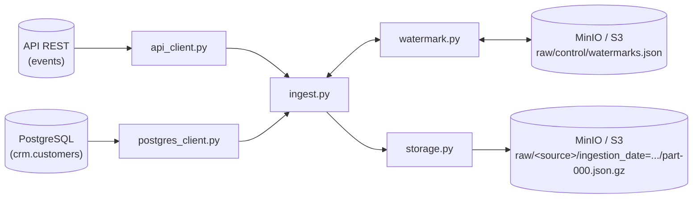

# Ingestion — Pipeline de Ingestão Raw

Pipeline de ingestão que extrai dados de duas fontes (uma API REST e um banco
PostgreSQL), persiste os registros brutos em formato NDJSON comprimido
(`.json.gz`) no MinIO/S3 seguindo particionamento Hive por `ingestion_date`, e
controla incrementalidade via watermarks.

## Estrutura do módulo

```
ingestion/
├── config.py            # Carrega variáveis de ambiente (.env) e constantes do pipeline
├── api_client.py         # Extração da fonte "events" via API REST (paginação + retry)
├── postgres_client.py     # Extração da fonte "customers" via PostgreSQL
├── watermark.py          # Leitura/escrita do estado incremental (watermark) no MinIO
├── storage.py            # Serialização NDJSON + gravação comprimida (gzip) no MinIO
└── ingest.py             # Orquestrador: liga todos os módulos acima
```

### `config.py`
Carrega variáveis de ambiente com `python-dotenv` e expõe constantes usadas por
todos os outros módulos (endpoint/credenciais do MinIO, URL/chave da API,
credenciais do Postgres, e os caminhos fixos usados no lakehouse:
`WATERMARK_KEY`, `RAW_EVENTS_PREFIX`, `RAW_CUSTOMERS_PREFIX`).

### `api_client.py`
Responsável por extrair a fonte **events** de uma API REST paginada.

- `fetch_all_events(since)`: percorre todas as páginas retornadas pela API,
  filtrando por `updated_at >= since` (ou `1970-01-01T00:00:00Z` na primeira
  execução), aplica um throttle de 0.1s entre requisições e retorna
  `(records, metrics)`.
- `_fetch_page_with_retry(...)`: busca uma única página tratando:
  - **HTTP 429** → aguarda o tempo do header `Retry-After` (fallback 60s);
  - **HTTP 5xx / erro de conexão** → backoff exponencial (1s, 2s, 4s, 8s, 16s)
    até 5 tentativas;
  - **HTTP 4xx** → interrompe imediatamente (erro de cliente, não é retryable).

### `postgres_client.py`
Responsável por extrair a fonte **customers** do PostgreSQL.

- `fetch_customers(since)`: consulta `crm.customers` filtrando
  `updated_at > since`, ordenado por `updated_at ASC`, converte os campos de
  data para string serializável em JSON e devolve a lista de registros.

### `watermark.py`
Controla o estado incremental do pipeline, guardado em um único arquivo JSON
no MinIO (`raw/control/watermarks.json`), com uma chave por fonte.

- `read_watermark(s3_client, source)`: lê o `last_updated_at` salvo para a
  fonte. Se o arquivo não existir (`NoSuchKey`) ou estiver corrompido, trata
  como primeira execução e retorna `None`.
- `write_watermark(s3_client, source, last_updated_at)`: atualiza apenas a
  chave da fonte informada, preservando o estado das demais fontes.

### `storage.py`
Persiste os registros extraídos na **raw zone** do lakehouse.

- `_to_ndjson(records)`: serializa a lista de dicionários em NDJSON (um JSON
  por linha).
- `save_raw_batch(s3_client, records, source, ingestion_date)`: gera o NDJSON,
  comprime com `gzip` e grava no MinIO seguindo particionamento Hive:

  ```
  raw/<source>/ingestion_date=<YYYY-MM-DD>/part-000.json.gz
  ```

  Content-Type gravado como `application/gzip`. Se não houver registros,
  nenhum objeto é criado.

### `ingest.py`
Orquestrador do pipeline (`run_pipeline(ingestion_date)`), executado via
`python -m ingestion.ingest [YYYY-MM-DD]` (usa a data de hoje se omitida).
Para cada fonte (`events`, `customers`):

1. lê o watermark atual;
2. extrai os dados novos desde o watermark;
3. se houver registros, grava o lote comprimido no MinIO e atualiza o
   watermark com o maior `updated_at` do lote;
4. se não houver registros, apenas loga e segue para a próxima fonte.

Ao final, loga um evento estruturado `ingestion_completed` com a contagem de
registros processados por fonte.

## Diagrama de execução


## Camadas externas


